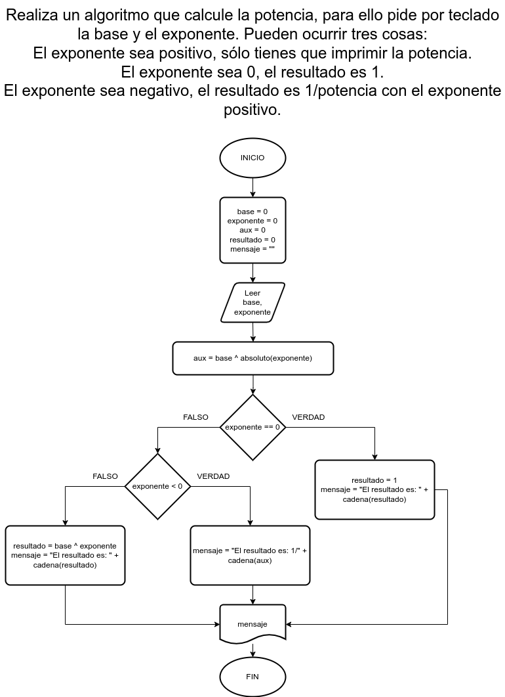

# Ejercicio 7 selectiva

## Planteamiento del problema

Realiza un algoritmo que calcule la potencia, para ello pide por teclado la base y el exponente. Pueden ocurrir tres cosas:

- El exponente sea positivo, sólo tienes que imprimir la potencia.
- El exponente sea 0, el resultado es 1.
- El exponente sea negativo, el resultado es 1/potencia con el exponente positivo.

### Análisis

- **Datos de entrada:** La base, el exponente.
- **Datos de salida:** La potencia si el exponente es positivo, la potencia en 1 si el exponente es 0, o 1 sobre potencia con el exponente positivo.
- **Variables:** base, exponente, aux, resultado: Como Enteras, mensaje: Como Carácter.
- _Cálculos:_
```C
Si exponente es positivo: resultado = base ^ exponente
Si exponente es 0: resultado = 1
Si exponente es negativo: resultado = 1/potencia^exponente
```

### Diseño

1. Ingresar dos números enteros.
2. Asignar dichos números en las variables *base* y *exponente* respectivamente.
3. Confirmar si *exponente* es igual a cero, entonces el resultado es directamente uno.
4. Asignar en la variable *aux* el resultado de la potencia con la *base* y *exponente* en valor absoluto.
5. Caso contrario, si *exponente* es negativo, entonces el resultado es 1/potencia(aux) con exponente positivo.
6. En todo caso, si *exponente* es positivo, es realizar la dicha potencia normalmente.
7. Asignar en la variable *resultado* dichos resultados.
8. Usar la variable *mensaje* para los mensajes respectivos.
9. Escribir por pantalla el resultado con mensajes.

## Diagrama de flujo


