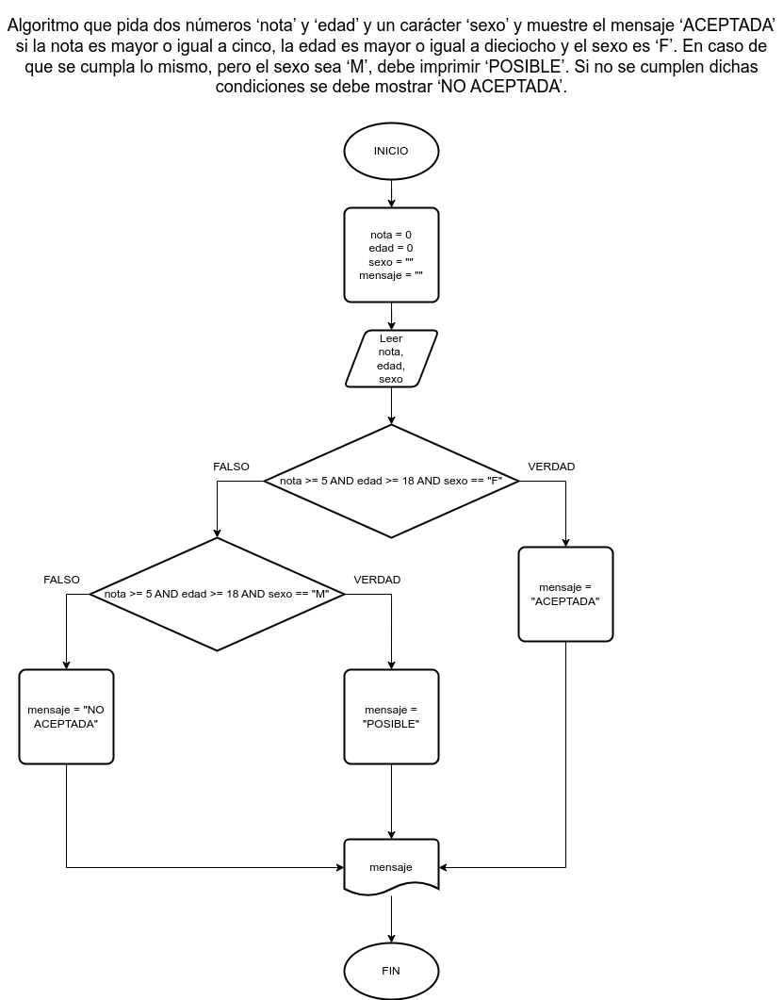

# Ejercicio 8 selectiva

## Planteamiento del problema

Algoritmo que pida dos números ‘nota’ y ‘edad’ y un carácter ‘sexo’ y muestre el mensaje ‘ACEPTADA’ si la nota es mayor o igual a cinco, la edad es mayor o igual a dieciocho y el sexo es ‘F’. En caso de que se cumpla lo mismo, pero el sexo sea ‘M’, debe imprimir ‘POSIBLE’. Si no se cumplen dichas condiciones se debe mostrar ‘NO ACEPTADA’.

### Análisis

- **Datos de entrada:** Nota, edad, y el sexo.
- **Datos de salida:** Mensaje de 'ACEPTADA', 'POSIBLE', 'NO ACEPTADA'. Dependiendo de ciertas condiciones.
- **Variables:** sexo, mensaje: Como Carácter; edad, nota: Como Enteros.
- _Cálculos:_
```C
Si nota >= 5 AND edad >= 18 AND sexo == "F" Entonces
    mensaje = "ACEPTADA"
De lo Contrario
    Si nota >= 5 AND edad >= 18 AND sexo == "M" Entonces
        mensaje = "POSIBLE"
    De lo Contrario
        mensaje = "NO ACEPTADA"
    Fin(Si)
Fin(Si)
```

### Diseño

1. Ingresar la nota, edad, y sexo de la persona.
2. Asignar dichos valores en las variables *nota*, *edad*, y *sexo* respectivamente.
3. Verificar si la *nota* es mayor a 5 y la *edad* es mayor o igual a 18, y que *sexo* sea igual a "F".
4. Si es **VERDADERO**, entonces asignar en la variable *mensaje* el valor de "ACEPTADA".
5. Si es **FALSO**, entonces verificar si la *nota* es mayor a 5, la *edad* sea mayor o igual a 18, y que *sexo* sea igual a "M".
6. Si es **VERDADERO**, entonces asignar en la variable *mensaje* el valor de *POSIBLE*.
7. En dado caso que todas las afirmaciones han sido **FALSAS**, entonces asignar en la variable *mensaje*: "NO ACEPTADA".
8. Escribir el *mensaje* en pantalla.


## Diagrama de flujo


