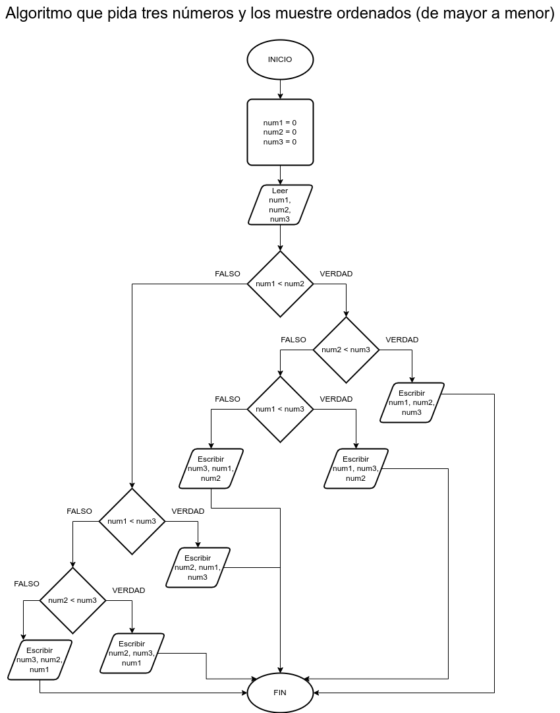

# Ejercicio 9 selectiva

## Planteamiento del problema

Algoritmo que pida tres números y los muestre ordenados (de mayor a menor).

### Análisis

- **Datos de entrada:** Tres números enteros.
- **Datos de salida:** Los tres números ordenados.
- **Variables:** num1, num2, num3: Como Enteros.
- _Cálculos:_
```C
Son tres variables: num1, num2, y num3.
1. Comparar num1 y num2.
    Si num1 < num2; Son estas las posibilidades: 1° num1, num2, num3; 2° num1, num3, num2; 3° num3, num1, num2;
2. Comparar num2 y num3.
    Si num2 < num3 => Resultado 1°: num1, num2, num3;
    Si num3 < num2 => Resultado 2°: num1, num3, num2;
3. Comparar num3 y num1.
    Si num1 < num3 => Resultado 2°: num1, num3, num2;
    Si num3 < num1 => Resultado 3°: num3, num1, num2;
4. Comparar num2 con num1.
    Si num2 < num1; Son estas las posibilidades: 1° num2, num1, num3; 2° num2, num3, num1; 3° num3, num2, num1;
5. Comparar num1 con num3.
    Si num1 < num3 => Resultado 1°: num2, num1, num3;
    Si num1 > num3 y num2 < num3 => Resultado 2°: num2, num3, num1;
    Si num2 > num3 => Resultado 3°: num3, num2, num1;
```

### Diseño

1. Ingresar tres números enteros.
2. Asignar dichos datos en las variables *num1*, *num2*, y *num3*.
3. Comparar *num1* y *num2*.
4. Si es **VERDADERO**, comparar nuevamente *num2* y *num3*.
5. Si es **VERDADERO**, mostrar el primer resultado de: *num1*, *num2*, *num3*.
6. Si es **FALSO**, comparar el *num3* con el *num2*.
7. Si es **VERDADERO**, mostrar el segundo resultado de: *num1*, *num3*, *num2*.
8. Si es **FALSO**, mostrar el tercer resultado de: *num3*, *num1*, *num2*.
9. Comparar *num2* con *num1*.
10. Si es **VERDADERO**, comparar nuevamente *num1* es menor a *num3*.
11. Si es **VERDADERO**, mostrar el primer resultado: *num2*, *num1*, *num3*.
12. Si es **FALSO**, comparar *num1* con *num3* y *num2* y *num3*.
13. Si es **VERDADERO**, mostrar el segundo resultado: *num2*, *num3*, *num1*.
14. Si es **FALSO**, comparar *num2* y *num3*.
15. Si es **VERDADERO**, mostrar el tercer resultado: *num3*, *num2*, *num1*.
16. Escribir los resultados adecuadamente.

## Diagrama de flujo


